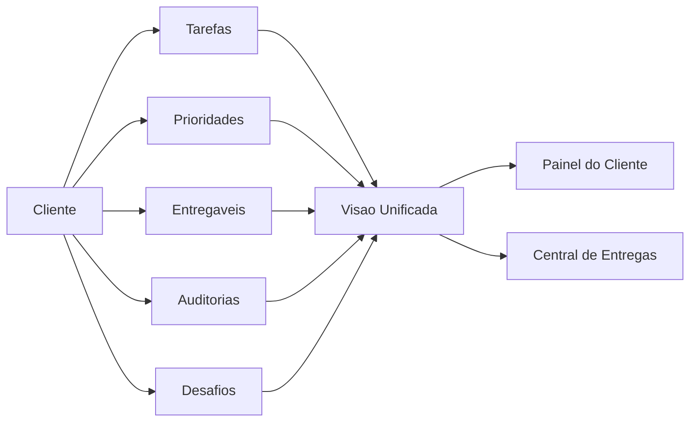
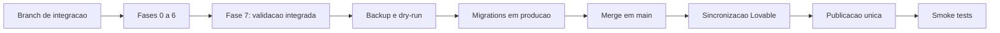

# Roadmap Operacional - Radar Vital

## Finalidade

Esta pasta e a fonte de verdade para a evolucao do Painel de Indicadores AC e
da Central de Entregas da Ramos Engenharia.

O objetivo e permitir que uma nova execucao consiga entender rapidamente:

- o que ja foi decidido;
- o que precisa ser construido;
- em qual ordem;
- quais tabelas e componentes serao afetados;
- como validar cada entrega;
- o que ainda depende de decisao.

## Documentos

| Documento | Funcao |
| --- | --- |
| [DECISIONS.md](DECISIONS.md) | Decisoes funcionais fechadas e pendencias reais |
| [IMPLEMENTATION_PLAN.md](IMPLEMENTATION_PLAN.md) | Fases, tarefas, arquivos e criterios de aceite |
| [DATA_MODEL.md](DATA_MODEL.md) | Modelo de dados alvo e regras de integridade |
| [STATUS.md](STATUS.md) | Estado vivo da execucao e proxima acao |
| [ISOLATED_VALIDATION.md](ISOLATED_VALIDATION.md) | Roteiro de banco de teste e portao da publicacao unica |
| [UNIVERSO_RAMOS_CHALLENGES_PLAN.md](UNIVERSO_RAMOS_CHALLENGES_PLAN.md) | Plano de desafios, metas e operacao interna do Universo Ramos |
| [UNIVERSO_RAMOS_IMPORT_PROCESS.md](UNIVERSO_RAMOS_IMPORT_PROCESS.md) | Fluxo controlado do Banco Mestre para rascunhos de desafios |

## Visao do produto

O Radar Vital passa a ter duas perspectivas principais sobre a mesma operacao:

1. **Visao por cliente**
   - Clientes AC e AV no painel principal.
   - Entidades internas no Universo Ramos.
   - Tudo que esta vinculado ao cliente em uma Visao Unificada.

2. **Visao por colaborador**
   - Central de Entregas.
   - Responsabilidades, tarefas, comentarios, prioridades e entregaveis.
   - Desafios, reconhecimento, desempenho e Tesouro de Estrelas.

## Dominios

Os registros continuam em dominios proprios:

- tarefa;
- prioridade;
- entregavel;
- auditoria;
- desafio;
- comentario;
- transacao de estrelas.

Eles serao reunidos apenas na camada de consulta por um modelo visual comum,
chamado `WorkItem`.

## Ordem obrigatoria

1. Fundacao tecnica de compatibilidade.
2. Universo Ramos.
3. Visao Unificada do Cliente.
4. Auditorias.
5. Desafios.
6. Tesouro de Estrelas.
7. Performance completa.
8. Qualidade, seguranca e publicacao.

Auditorias podem comecar depois da Visao Unificada. Desafios e Tesouro nao
devem entrar em producao antes da revisao de compatibilidade de dados e das
regras administrativas usadas pelo painel atual.

## Estrategia de lancamento

As oito fases sao etapas internas de implementacao e validacao. Elas nao
representam oito atualizacoes no Lovable.

Todo o roadmap sera desenvolvido em uma branch de integracao, usando Supabase
local ou um projeto de teste. A aplicacao publicada e o Supabase de producao
permanecem inalterados ate a aprovacao da Fase 7.

As fases devem gerar commits internos para proteger o trabalho e facilitar
revisoes. Esses commits nao devem ser mesclados em `main` antes do portao final.

Para o usuario, o resultado sera uma unica grande atualizacao. Tecnicamente, as
migrations continuarao separadas e serao aplicadas em ordem no mesmo ciclo de
lancamento.

## Principios de implementacao

- A interface atual deve evoluir sem perder os fluxos existentes.
- A fonte de verdade e o Supabase, nao `localStorage`, para dados compartilhados.
- Nesta versao, o acesso continua com o mesmo fluxo atual do painel: sem tela
  obrigatoria de login, senha, convite ou cadastro de e-mail.
- Nomes podem ser exibidos; UUIDs de colaboradores continuam preferiveis nos
  novos relacionamentos, mas nao havera `auth.users` como dependencia de uso.
- Pontuacao com valor financeiro exige historico imutavel.
- Correcao financeira e feita por estorno, nunca por exclusao.
- Atraso nao aplica penalidade automaticamente.
- Apenas Patrick, como administrador, valida auditorias, desafios e liquidacoes.
- Universo Ramos fica isolado por padrao, mas usa os mesmos recursos internos.
- Nenhuma fase parcial deve alterar a producao.
- Migrations devem ser aditivas e compativeis com a versao publicada atual.
- Autenticacao por Supabase Auth e RLS restritiva ficam fora deste lancamento e
  so poderao voltar em um roadmap futuro, com decisao explicita.

## Como executar uma fase

1. Marcar a fase como `EM ANDAMENTO` em `STATUS.md`.
2. Confirmar as decisoes relacionadas em `DECISIONS.md`.
3. Criar migration e tipos antes da interface, quando aplicavel.
4. Implementar consultas e regras de dominio.
5. Implementar interface e estados vazios/erro/carregamento.
6. Adicionar testes dos criterios de aceite.
7. Rodar build, lint e testes.
8. Atualizar `STATUS.md` com arquivos, migrations e resultados.
9. Criar commit de controle na branch de integracao.
10. Nao publicar nem aplicar a fase isoladamente em producao.

## Portao de publicacao unica

A publicacao final so pode acontecer quando:

- todas as fases estiverem marcadas como concluidas;
- os testes integrados estiverem aprovados;
- houver backup recente do banco de producao;
- o `dry-run` das migrations estiver revisado;
- as migrations forem compativeis com a interface atualmente publicada;
- o plano de retorno estiver documentado;
- a sincronizacao GitHub/Lovable estiver confirmada.
