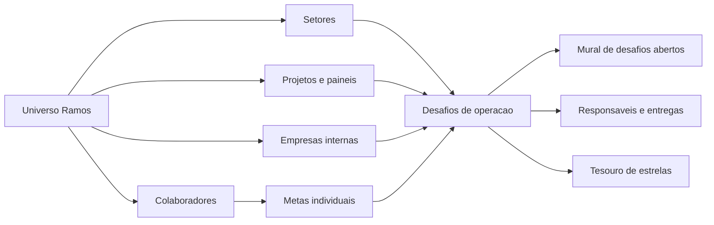
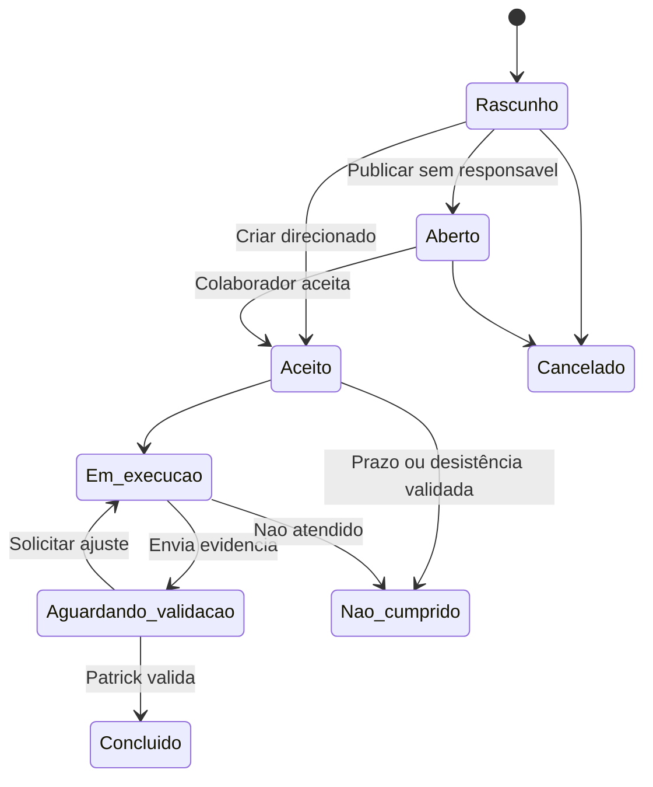

# Plano - Universo Ramos: Desafios, Metas e Demandas Internas

## Finalidade

Evoluir o Universo Ramos de uma grade de cadastros internos para uma central de
execucao da empresa. O foco e organizar o que precisa ser feito por setor,
projeto, empresa e colaborador, com contexto suficiente para a equipe executar
e o administrador validar.

Este plano nao altera o escopo externo AC/AV. O Universo Ramos continua
isolado dos totais e dos filtros de clientes externos.

## Decisao central

No Universo Ramos, uma demanda operacional relevante **ja nasce como
desafio**. Nao existira uma etapa obrigatoria de promover uma demanda simples
para desafio.

As metas de colaboradores tambem usam o mesmo dominio de desafio, mas sao
criadas como desafios individuais e ja nascem direcionadas a uma pessoa.



## Entidades do Universo Ramos

### Unidades internas

Cada card do Universo Ramos tem uma categoria persistida:

- `EMPRESA`: Ramos Engenharia, Ramos Participacoes e entidades relacionadas;
- `SETOR`: Marketing, Treinamentos, Administracao, Manutencao e semelhantes;
- `COLABORADOR`: pessoa ja cadastrada no sistema, exibida com foto e perfil;
- `PROJETO`: SISRAMOS, Painel Jornada e outras iniciativas ou paineis.

Colaboradores nao devem ser duplicados como clientes cadastrados manualmente.
A tela deve exibi-los a partir do cadastro de colaboradores existente.

### Desafio

O desafio e a unidade de trabalho oficial do Universo Ramos. Pode ser aberto
para a equipe, direcionado a uma pessoa ou coletivo. Ele pode estar ligado a
uma unidade interna e tambem a um cliente externo quando isso for desejado em
evolucoes futuras, sem misturar os paineis por padrao.

### Meta individual

Meta e um desafio cuja origem e um colaborador. Nao precisa ficar disponivel
para aceite por outras pessoas e pode medir desenvolvimento, conclusao ou uma
entrega pessoal.

Exemplo: estruturar e ministrar um treinamento sobre o Painel AC.

## Cadastro obrigatorio do desafio

Todo desafio deve conter, no minimo:

| Campo | Regra |
| --- | --- |
| Titulo | Curto, objetivo e pesquisavel. |
| Origem | Setor, projeto, empresa ou colaborador. |
| Tipo | Setor, projeto, empresa, meta individual ou geral da empresa. |
| Descricao | Contexto, motivo e resultado esperado. |
| Condicoes de conclusao | Checklist de criterios verificaveis para validar a entrega e acompanhar o progresso. Contexto livre fica na descricao. |
| Entregavel esperado | Documento, treinamento, compra, material, organizacao, registro ou outro resultado concreto. |
| Evidencia | Foto, arquivo, link, comentario, checklist ou combinacao deles. |
| Responsavel | Vazio para desafio aberto; um ou mais colaboradores para desafio direcionado/coletivo. |
| Prazo | Opcional; quando definido, deve ser exibido em todos os resumos. |
| Recompensa | Estrelas e/ou Super Estrelas; inicialmente pode ficar sem valor. |
| Penalidade | Opcional; somente aplicada apos validacao administrativa. |
| Status | Rascunho, Aberto, Aceito, Em execucao, Aguardando validacao, Concluido, Nao cumprido ou Cancelado. |
| Avaliacao | Validacao, observacao e decisao final do administrador. |

## Estados e fluxo



Regras:

- desafio aberto nao possui responsavel e pode ser aceito por um colaborador;
- meta individual ja nasce com responsavel definido;
- desafio coletivo pode ter varios participantes;
- recompensa e penalidade sao integrais para cada participante, conforme as
  regras do Tesouro;
- apenas Patrick/admin valida conclusao, recompensa e penalidade;
- o prazo vencido gera alerta, mas nao aplica penalidade automaticamente;
- a conclusao exige evidencia quando o desafio a solicitar;
- todos os eventos devem entrar no historico/auditoria.

## Experiencia nas telas

### Painel Universo Ramos

A grade deve continuar permitindo visao geral, mas precisa comunicar atividade:

- card neutro quando nao ha itens ativos;
- contador de desafios abertos/em execucao;
- icone proprio para desafio, diferente de prioridade e tarefa comum;
- indicador de atraso quando houver prazo vencido;
- avatares dos responsaveis;
- clique na area principal/logo abre a Central da unidade interna;
- clique no nome abre a edicao rapida do cadastro.

Filtros exclusivos do Universo Ramos:

- categoria: Empresas, Setores, Colaboradores e Projetos/Paineis;
- com desafios abertos;
- com desafios em execucao;
- com metas;
- com atrasos;
- com prioridade;
- sem pendencias;
- por colaborador responsavel.

Contadores do cabecalho devem ser clicaveis e aplicar o filtro correspondente.
O controle `Pode dar BO` nao aparece no Universo Ramos.

### Central da unidade interna

Ao abrir um setor, projeto ou empresa, disponibilizar:

1. **Visao geral**: desafios ativos, atrasados, em validacao e responsaveis.
2. **Desafios**: lista detalhada, com descricao, criterio, recompensa e status.
3. **Planejamento**: desafios em rascunho e iniciativas futuras.
4. **Comentarios**: decisoes e contexto registrados.
5. **Historico**: criacao, aceite, entrega, validacao e alteracoes.

Ao abrir um colaborador, a central muda de perspectiva:

1. metas individuais;
2. desafios abertos que pode aceitar;
3. desafios aceitos/em execucao;
4. tarefas e entregaveis vinculados;
5. estrelas, Super Estrelas, saldo e evolucao.

### Mural de desafios abertos

Criar uma visualizacao dentro do Universo Ramos para a equipe encontrar
oportunidades sem responsavel. Cada item mostra origem, titulo, descricao
resumida, prazo, recompensa, criterios e botao `Aceitar desafio`.

## Arquivo de carga inicial

Antes da implementacao, os desafios devem ser organizados em
`docs/roadmap/desafios-iniciais.csv` ou planilha equivalente, usando estas
colunas:

```text
titulo
origem_nome
origem_categoria
tipo
descricao
condicoes_conclusao (itens separados por `;`)
entregavel_esperado
evidencia_necessaria
responsavel_inicial
participantes
prazo
recompensa_estrelas
recompensa_super_estrelas
penalidade_estrelas
status_inicial
observacoes_administrador
```

O arquivo e apenas fonte de carga. A fonte de verdade apos a importacao sera o
Supabase. Na carga inicial, recompensas e penalidades ficam zeradas e sao
definidas posteriormente na Biblioteca de Oportunidades.

## Fases de implementacao

### Fase UR-1 - Fundacao de dados

- revisar a tabela `challenges` atual e estender somente os campos ausentes;
- criar ou consolidar relacionamentos com unidade interna, participantes,
  criterios, evidencias e eventos;
- garantir migrations aditivas e compativeis;
- atualizar os tipos gerados e hooks de consulta;
- criar testes de transicao de estado e recompensa integral por participante.

### Fase UR-2 - Cadastro e detalhe de desafio

- criar formulario de desafio com todos os campos obrigatorios;
- permitir rascunho, desafio aberto, direcionado e coletivo;
- registrar evidencias e comentarios;
- permitir que somente admin valide resultado, premio ou penalidade.

### Fase UR-3 - Central do Universo Ramos

- construir detalhe de setor/projeto/empresa;
- abrir a central pelo card;
- mostrar abas de visao geral, desafios, planejamento, comentarios e historico;
- manter a grade principal leve e visual.

### Fase UR-4 - Colaboradores e metas

- derivar cards de colaborador do cadastro existente, com foto;
- criar visao individual de metas e desafios;
- integrar com Central de Entregas sem duplicar tarefas;
- mostrar desafios abertos elegiveis para aceite.

### Fase UR-5 - Mural de desafios abertos e Tesouro

- criar visualizacao de desafios sem responsavel;
- implementar aceite com registro de data/hora;
- conectar premio e penalidade ao Tesouro somente apos validacao;
- impedir duplicidade de aceite e lancamentos financeiros repetidos.

### Fase UR-6 - Importacao inicial e validacao

- validar o arquivo de carga inicial;
- apresentar erros por linha antes de importar;
- importar em modo idempotente;
- testar filtros, historico, aceite, validacao, premio e penalidade;
- atualizar STATUS.md com resultados e pendencias.

## Criterios de aceite finais

- e possivel cadastrar um desafio completo com descricao e criterios claros;
- e possivel publicar um desafio aberto sem responsavel;
- um colaborador pode aceitar um desafio aberto elegivel;
- metas individuais aparecem somente na visao do colaborador e nas consultas
  administrativas relevantes;
- uma unidade interna mostra todos os desafios e historico associados;
- premio e penalidade so ocorrem depois da validacao administrativa;
- valores financeiros sao registrados no Tesouro sem apagar historico;
- filtros do Universo Ramos nao exibem controles externos AC/AV, municipio ou
  `Pode dar BO`;
- a importacao inicial nao duplica desafios ja cadastrados;
- painel externo AC/AV continua sem regressao.

## Fora de escopo nesta rodada

- login novo, convite por e-mail ou mudanca no fluxo de acesso atual;
- penalidade automatica por prazo;
- mistura automatica dos desafios internos nos totais AC/AV;
- apagar transacoes de estrelas ja emitidas;
- exposicao publica de desafios para usuarios externos.
